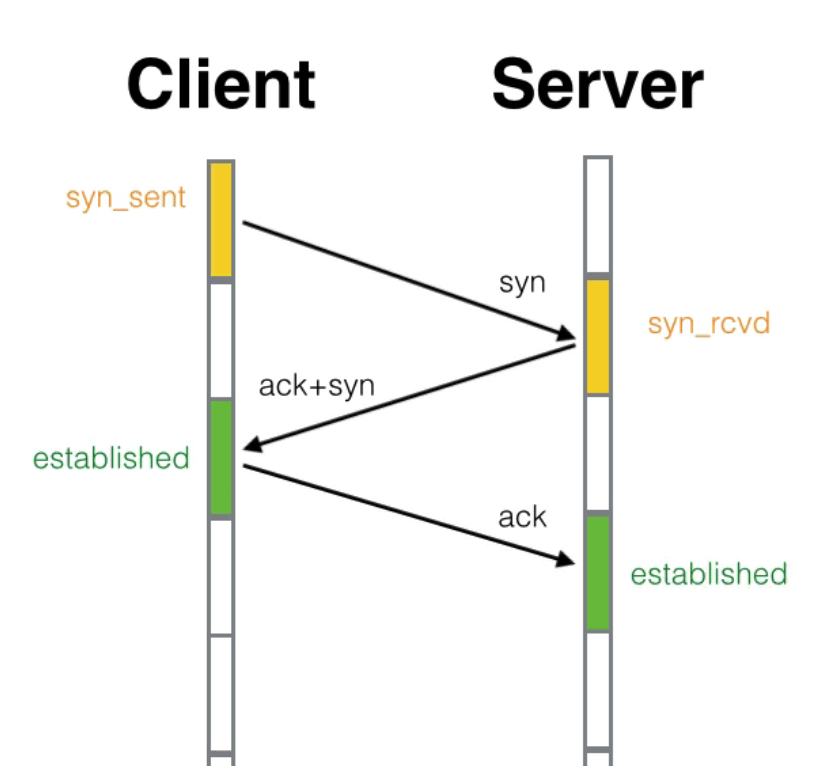
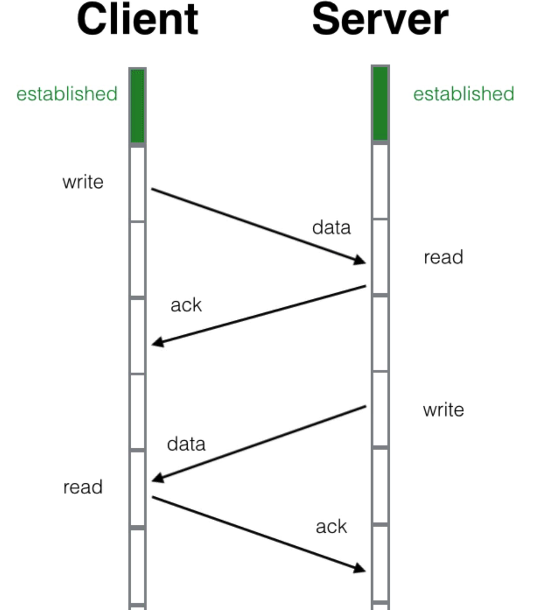
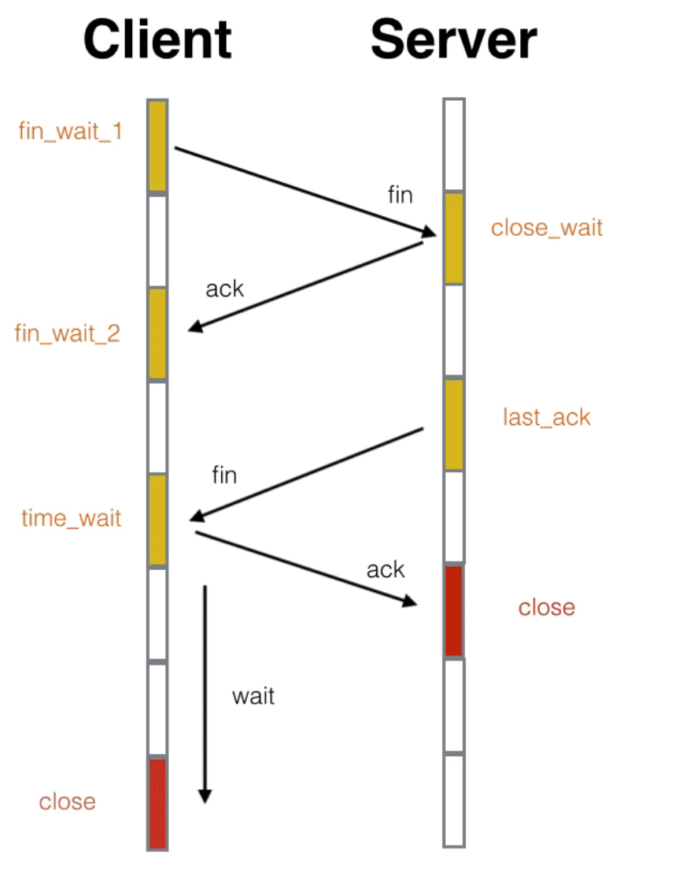

# TCP

## TCP 三次握手和四次挥手

1. client 发送 syn 给 server，此时 client 状态为 syn_sent
2. server 接收到 syn 后发送 ack 给 client，此时 server 状态为 sync_rcvd
3. client 接收到 ack 后，client 状态变为 established
4. server 发送 syn 给 client
5. client 接收到 syn 后发送 ack 个 server，server 状态变为 established

通常的流程如上，但可以把 2、4 进行合并，即和图片一样只有三次握手

syn_sent 和 syn_rcvd，这两个状态叫着「半打开」状态。syn_sent 是主动打开方的「半打开」状态，syn_rcvd 是被动打开方的「半打开」状态。

可以把 syn 当作打招呼，ack 当作打招呼的回应去理解

## TCP 传输

如果 client 传输 data 时，没有接收到返回的 ack，那么 client 就会再次发送 data，即 **重传**

如果 server 连续接收到多个 client 的相同 data，那么 server 就只会取其中一个，即 **去重**

client 和 server 可以相互传输，因为 TCP 是 **双工** 的

client 连续发送多个 data，server 可以只回一个 ack，即 **批量ack**

client 不能连续发送太多个 data，server 可能处理不过来，两者之间需要有协商好的合适的发送和接受速率，这个就是 **TCP窗口大小**

## TCP 四次挥手

上面有一个非常特殊的状态time_wait，它是主动关闭的一方在回复完对方的挥手后进入的一个长期状态，这个状态标准的持续时间是4分钟，4分钟后才会进入到closed状态，释放套接字资源。不过在具体实现上这个时间是可以调整的

time_wait 状态下，如果 server 没有拿到 ack，会再次发送 fin 给 client，此时 time_wait 状态下的 client 会再次发送 ack 给 server。同时在这段时间内，该链接收到的报文传都会被立即丢弃掉。4分钟的时间足以使得这些残留报文彻底消逝。不然当新的端口被重复利用时，这些残留报文可能会干扰新的链接

4 分钟就是 2 个 MSL，每个 MSL 是 2 分钟。MSL 就是 maximium segment lifetime —— 最长报文寿命

四次挥手也并不总是四次挥手，中间的两个动作有时候是可以合并一起进行的，这个时候就成了三次挥手，主动关闭方就会从fin_wait_1 状态直接进入到 time_wait 状态，跳过了 fin_wait_2 状态

## TCP 有哪些手段保证可靠交付

1. 将数据截断为合理的长度
2. 超时重发
3. 对于收到的请求，给出确认响应
4. 接收端校验报文段有错会丢弃报文段，不给出响应；发送端没收到响应，超时时会重发数据
5. 对失序数据进行重新排序，然后才交给应用层
6. 对于重复数据，能够丢弃重复数据
7. TCP可以进行流量控制，防止较快主机致使较慢主机的缓冲区溢出